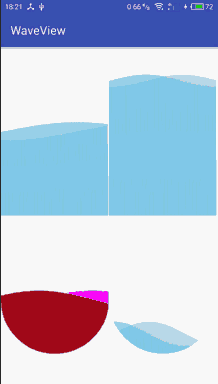

WaveView
========

## First View




## Add to your project

#### Step 1. Add the JitPack repository to your build file
Add it in your root build.gradle at the end of repositories:

```
allprojects {
    repositories {
        ...
        maven { url 'https://jitpack.io' }
    }
}
```

#### Step 2. Add the dependency

```
dependencies {
     compile 'com.github.onlynight:WaveView:1.0.0'
}
```

## How to use

in your xml file:

```xml
<com.github.onlynight.waveview.WaveView
    android:id="@+id/waveView1"
    android:layout_width="0dp"
    android:layout_height="match_parent"
    android:layout_weight="1"
    app:isCircle="false"
    app:period="4"
    app:waveHeightPercent="0.5"
    app:waveRange="15dp"
    app:waveSpeed="10"
    app:waveStrokeWidth="3dp"/>
```

in your java code file:

```java
mWaveView1 = (WaveView) findViewById(R.id.waveView1);
mWaveView1.start();
```

## property explain

```xml

<declare-styleable name="WaveView">

    <!-- define wave speed, example value 10 -->
    <attr name="waveSpeed" format="float"/>

    <!-- define wave range, example value 15dp -->
    <attr name="waveRange" format="dimension|reference"/>

    <!-- define wave 1 color -->
    <attr name="wave1Color" format="color|reference"/>

    <!-- define wave 2 color -->
    <attr name="wave2Color" format="color|reference"/>

    <!-- define wave height percent, the value is between 0 to 1 -->
    <attr name="waveHeightPercent" format="float"/>

    <!-- define paint stroke width, if you want optimizing view,
    you should change the stroke width more-->
    <attr name="waveStrokeWidth" format="dimension|reference"/>

    <!-- if the view is circle -->
    <attr name="isCircle" format="boolean"/>

    <!-- the sine wave period, value range 0 to all -->
    <attr name="period" format="float"/>

</declare-styleable>

```